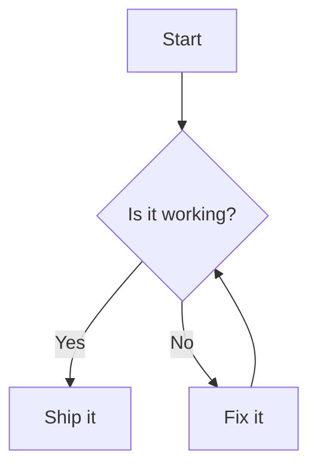

# Mermaid SVG filter for Moodle (server-side via Kroki)

Render Mermaid diagrams on the server and embed the result as static SVG/PNG in Moodle.  
This makes diagrams visible everywhere, including the Moodle App and PDF exports, without requiring client-side JS.

- Component: `filter_mermaidsvg`
- Folder: `filter/mermaidsvg`
- Renders using a Kroki instance (default: https://kroki.io)

## Features
- Detects Mermaid code blocks and [mermaid] short tags in content.
- Renders once via Kroki and caches the image in Moodle file storage.
- Serves cached images via `pluginfile.php` with proper URLs.
- Configurable output format (SVG or PNG) and HTTP timeout.
- No personal data stored (privacy null provider).

## Requirements
- Moodle 4.0 or later (also works on 5.x).
- Outbound HTTP(S) to a Kroki server (public `https://kroki.io` or self-hosted).

## Installation
Choose one of the following:

1) Git clone into your Moodle root
- From your Moodle directory:
  - `filter/mermaidsvg/` must be the destination folder.
- Example:
  - `git clone https://github.com/miscusitech/moodle-fitler_mermaidsvg filter/mermaidsvg`

2) Upload a ZIP
- Download a release ZIP from GitHub, extract, and place the contents in `filter/mermaidsvg`.

After files are in place, visit Site administration to complete the plugin installation/upgrade.

## Configuration
Site administration → Plugins → Filters → Manage filters
- Enable “Mermaid (server-side via Kroki)”.

Site administration → Plugins → Filters → Mermaid (server-side via Kroki)
- Kroki base URL: e.g. `https://kroki.io` or your internal instance
- Format: `svg` (recommended) or `png`
- HTTP timeout (seconds): small value like `5` is reasonable

## Usage
Author content in any text area supporting Markdown or HTML.

- Markdown fenced code block:

```

```

- Short tag (useful in HTML editors):

```
[mermaid]
sequenceDiagram
  participant U as User
  participant M as Moodle
  U->>M: open page
  M-->>U: diagram image
[/mermaid]
```

On first view, the filter renders the diagram via Kroki and stores the image. Subsequent views use the cached image.

## Privacy
This filter stores no personal data and declares a privacy null provider.

## Troubleshooting
- Diagrams do not render:
  - Verify the Kroki base URL and that Moodle can reach it (network/firewall/proxy).
  - Try increasing the HTTP timeout.
- Broken images after changing settings:
  - The filter caches images by content hash. Edit the diagram or purge caches to force re-rendering.
- Moodle App shows nothing:
  - Ensure the filter is enabled site-wide and at the appropriate context. This plugin embeds static images, so it should display in the app.

## Development notes
- Core code lives in `filter/mermaidsvg/classes/text_filter.php` (namespaced class `filter_mermaidsvg\text_filter`).
- `filter.php` provides a legacy `class_alias` for backwards compatibility with Moodle’s filter loader.
- Rendered files are stored in component `filter_mermaidsvg`, filearea `rendered`.
- The plugin uses simple cURL calls to Kroki; failures are logged via `debugging()` at developer level.

### Contributing
- Run coding style checks with Moodle’s CodeSniffer standard (see moodle-plugin-ci).
- Please keep language strings ordered and include Moodle GPL headers in files.

## License
GNU General Public License v3 or later. See `filter/mermaidsvg/LICENSE`.